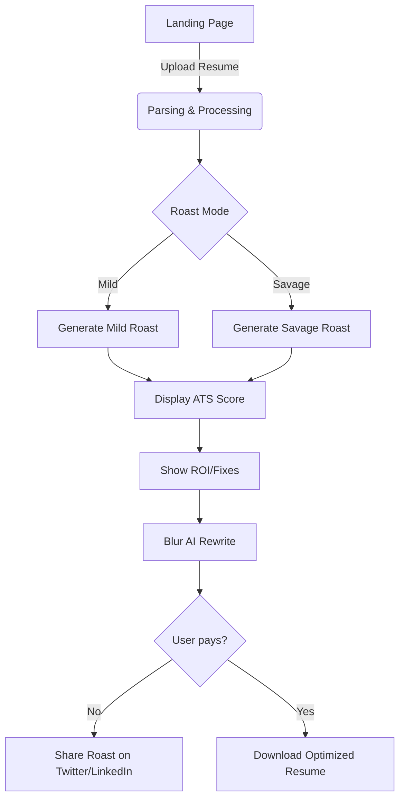
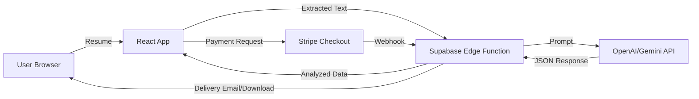
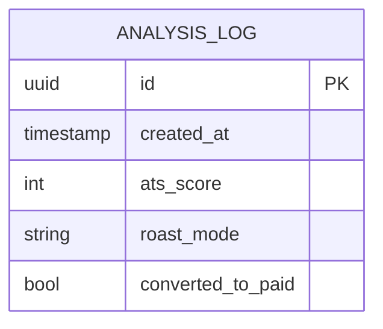
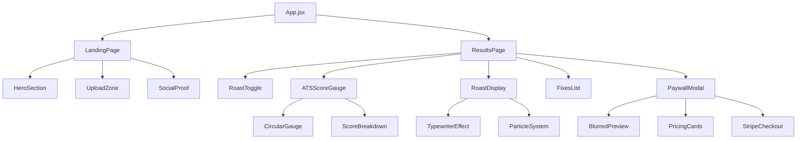
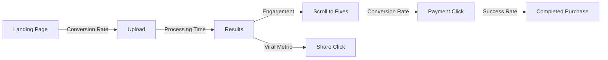
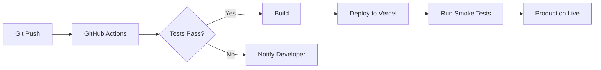

# 🔥 Product Requirements Document (PRD): Resume Roaster

**Version:** 1.0  
**Status:** Draft  
**Target Platform:** Web Application  
**Tech Stack:** React, Tailwind CSS (implied for styling), Supabase, AI (LLM) Integration  

---

## 1. Executive Summary
**Resume Roaster** is a web application that takes a boring resume, "roasts" it with savage, humorous feedback, and then offers constructive, actionable fixes. It gamifies the resume review process, making it viral and shareable, while driving monetization through premium AI-powered rewrites.

**Core Philosophy:** "Damn… this roasted me but also helped me."
**Tone:** Witty, edgy, playful, and brutally honest.

---

## 2. Problem & Solution
- **The Problem:** Job hunting is depressing. Resume advice is boring and generic. Job seekers are tired of "professional" feedback that tells them nothing.
- **The Solution:** An entertaining, instant feedback loop that uses humor ("roasting") to hook the user, followed by high-value, specific improvements ("fixing") to prove competence.

---

## 3. User Personas
1.  **The Desperate Job Seeker:** Applied to 100s of jobs, getting no callbacks. Willing to pay for a quick fix.
2.  **The Curious Professional:** Has a job but wants to see what the "roast" says. Likely to share on social media.
3.  **The New Grad:** Clueless about industry standards, needs blunt guidance.

---

## 4. Functional Requirements (MVP)

### 4.1. Landing Page & Hero Section
- **Goal:** high conversion to upload.
- **Elements:**
    - Catchy Headline: "Your Resume Sucks. Let Us Fix It."
    - Drag & Drop Upload Zone (Central Focus).
    - "Roast Me" Call-to-Action (CTA).
    - Social Proof/Ticker: "10,000 resumes roasted and crying."

### 4.2. Resume Ingestion
- **Input:** PDF, DOCX.
- **Process:**
    - Parse text content from the file.
    - **Constraint:** Limit file size (e.g., 5MB).
    - **Privacy:** State clear privacy policy (files deleted after processing - unless saved for premium).

### 4.3. The Roast (The "Viral" Hook)
- **Features:**
    - **Savage Level Toggle:** 🌶️ Mild vs. 🔥 Savage (Default).
    - **Streaming Output:** Text should appear as if it's being typed/thought out by a sassy AI.
    - **Content:**
        - Pick apart clichés ("motivated self-starter").
        - Mock formatting errors.
        - Call out generic skills.
- **UI:** Shaking text effects, fire emojis, red accents.

### 4.4. ATS Scoring System
- **Display:** Large, animated gauge/counter (0-100).
- **Psychological Trigger:** Lower scores are accompanied by harsher text ("Ghosted harder than a bad Tinder date").
- **Breakdown:** Brief explanation of *why* the score is low (e.g., "Missing keywords", "Bad formatting").

### 4.5. Actionable Fixes (The "Value")
- **Transition:** After the roast, pivoting to helpfulness.
- **Content:**
    - "Top 5 Mistakes" list.
    - "Before vs. After" examples for specific bullet points.
    - **Example:**
        - ❌ "Responsible for sales."
        - ✅ "Generated $50k in revenue Q3 by optimizing lead funnels."

### 4.6. Monetization (The Paywall)
- **Offer:** "AI Rewrite Preview".
- **Mechanism:** Show a blurred preview of the perfectly rewritten resume.
- **Tiers:**
    - **Basic ($5):** Full ATS-optimized rewrite download.
    - **Pro ($9):** Rewrite + LinkedIn Bio + Cold Email Template.
- **Payment Gateway:** Stripe/LemonSqueezy integration.

---

## 5. Non-Functional Requirements
- **Performance:** Roast generation under 10 seconds.
- **Aesthetics:** "Dark Mode" default, neon accents, glassmorphism, smooth micro-interactions.
- **Responsiveness:** Mobile-first design (many will try it on phone).
- **No Login:** Analysis results are session-based or hash-based. No account creation required for MVP to reduce friction.

---

## 6. Technical Architecture

### 6.1. Tech Stack
- **Frontend:** React (Vite), Framer Motion (for animations), Tailwind CSS.
- **Backend/Storage:** Supabase (storage for temp uploads if needed, Edge Functions for handling AI proxying to hide API keys).
- **AI/LLM:** OpenAI GPT-4o or Gemini Pro (via Supabase Edge Functions).
- **Payment:** Stripe/LemonSqueezy.

### 6.2. Data Flow
1.  User uploads file -> Frontend parses text (or sends to backend).
2.  Text -> sent to AI Prompt (Roast + Score + Improvements).
3.  AI Stream -> Returns JSON { roast, score, fixes, rewritten_content_preview }.
4.  Frontend renders Roast -> Score -> Fixes.
5.  User clicks "Unlock" -> Payment flow -> Returns full `rewritten_content`.

---

## 7. Diagrams

### 7.1. User Flow


### 7.2. System Architecture


### 7.3. Database Schema (Supabase - Minimal)
*Since there is no login, we track generic usage.*


---

## 8. UI/UX Design Specifications
- **Theme:** Cyberpunk/Dark Web vibes. Black background, neon green/pink text.
- **Typography:** Monospace for the "Roast" text (terminal style), Sans-serif for the UI.
- **Animations:**
    - The Roast text types out like a chat.
    - The ATS Score counts up rapidly.
    - "Fire" particle effects when the score is low (burning).

## 9. Development Roadmap
- **Phase 1 (Day 1-2):** Skeleton setup, PDF parser, Basic OpenAI integration.
- **Phase 2 (Day 3-4):** Roast Logic (Prompt Engineering), Visualization (Score gauge).
- **Phase 3 (Day 5):** Payment Integration, "Fake" Rewrite Preview (Blur effect).
- **Phase 4 (Day 6-7):** Polish, Animations, Mobile testing.

---

## 10. API Specifications

### 10.1. Resume Analysis Endpoint
**Endpoint:** `/api/analyze`  
**Method:** POST  
**Headers:** `Content-Type: multipart/form-data`

**Request:**
```json
{
  "file": "resume.pdf",
  "roast_mode": "savage" | "mild"
}
```

**Response:**
```json
{
  "analysis_id": "uuid",
  "ats_score": 47,
  "roast": {
    "intro": "Oh boy, where do I even start...",
    "points": [
      "Your summary says 'hardworking'. So does literally everyone.",
      "You used 'responsible for' 6 times. HR fell asleep by the second one."
    ],
    "conclusion": "This resume needs life support."
  },
  "score_breakdown": {
    "formatting": 60,
    "keywords": 30,
    "impact": 45,
    "clarity": 50
  },
  "top_mistakes": [
    {
      "category": "Generic Language",
      "before": "Responsible for managing team",
      "after": "Led 5-person engineering team to deliver 3 features ahead of schedule",
      "impact": "high"
    }
  ],
  "preview_available": true,
  "timestamp": "2026-01-31T07:20:38Z"
}
```

### 10.2. Payment Webhook
**Endpoint:** `/api/webhook/stripe`  
**Method:** POST  
**Purpose:** Handle successful payments and deliver premium content

**Response Actions:**
- Generate full rewritten resume
- Send download link via email
- Update analytics log

---

## 11. Component Architecture

### 11.1. Frontend Component Tree


### 11.2. Key Components Specifications

#### UploadZone Component
```javascript
// Props
{
  onFileUpload: (file) => void,
  maxSize: 5242880, // 5MB
  acceptedFormats: ['.pdf', '.docx'],
  isProcessing: boolean
}

// States
- isDragging
- uploadProgress
- error
```

#### ATSScoreGauge Component
```javascript
// Props
{
  score: number (0-100),
  breakdown: {
    formatting: number,
    keywords: number,
    impact: number,
    clarity: number
  },
  animationDuration: 2000
}

// Features
- Animated counter from 0 to score
- Color coding (0-40: red, 41-70: yellow, 71-100: green)
- Pulsing effect for low scores
```

#### RoastDisplay Component
```javascript
// Props
{
  roastData: {
    intro: string,
    points: string[],
    conclusion: string
  },
  mode: 'mild' | 'savage',
  onComplete: () => void
}

// Features
- Typewriter effect (50ms per character)
- Shake animation on harsh points
- Fire particle effects
- Sound effects (optional)
```

---

## 12. Error Handling & Edge Cases

### 12.1. File Upload Errors
| Error | User Message | Action |
|-------|-------------|--------|
| File too large | "Whoa there! Your resume is bigger than your ambitions. Keep it under 5MB." | Reject upload |
| Wrong format | "We need a PDF or DOCX. Screenshots don't count." | Show format guide |
| Corrupted file | "This file is more broken than your career prospects. Try another." | Request re-upload |
| No text detected | "Is this resume invisible? We couldn't find any text." | Suggest OCR or reformat |

### 12.2. AI Processing Errors
| Error | User Message | Action |
|-------|-------------|--------|
| API timeout | "Our AI is thinking too hard. Give it another shot." | Retry button |
| Rate limit | "Too many roasts at once! Wait 30 seconds." | Show countdown |
| Invalid response | "The AI had a stroke. Let's try that again." | Auto-retry once |

### 12.3. Payment Errors
| Error | User Message | Action |
|-------|-------------|--------|
| Card declined | "Your card said no. Maybe it's protecting you from the truth." | Retry payment |
| Network error | "Payment got lost in the void. Try again?" | Retry with same session |
| Already purchased | "You already bought this! Check your email." | Show support link |

---

## 13. Security & Privacy

### 13.1. Data Handling
- **File Storage:** Temporary storage only (auto-delete after 24 hours)
- **Text Extraction:** Process in-memory, no permanent storage
- **Payment Data:** Never stored (handled by Stripe)
- **Analytics:** Anonymized, no PII

### 13.2. Security Measures
- **File Validation:** Strict MIME type checking
- **Size Limits:** 5MB hard cap
- **Rate Limiting:** 5 uploads per IP per hour
- **API Keys:** Stored in Supabase Vault, accessed via Edge Functions
- **CORS:** Whitelist production domain only
- **Content Security Policy:** Strict CSP headers

### 13.3. Privacy Policy (Summary)
- Files deleted after processing
- No account required = no data retention
- Email only collected for paid users
- No third-party sharing
- GDPR/CCPA compliant

---

## 14. Analytics & Tracking

### 14.1. Key Metrics to Track


### 14.2. Events to Track
| Event | Trigger | Data |
|-------|---------|------|
| `page_view` | Landing page load | `referrer`, `device` |
| `upload_start` | File selected | `file_size`, `file_type` |
| `upload_complete` | Analysis begins | `processing_time` |
| `roast_viewed` | Results displayed | `ats_score`, `roast_mode` |
| `toggle_roast_mode` | User switches mode | `from_mode`, `to_mode` |
| `fixes_viewed` | User scrolls to fixes | `scroll_depth` |
| `paywall_shown` | Blur preview shown | `ats_score` |
| `payment_initiated` | Checkout clicked | `tier` |
| `payment_completed` | Stripe success | `amount`, `tier` |
| `share_clicked` | Social share | `platform` |

### 14.3. Analytics Tools
- **Primary:** Plausible Analytics (privacy-friendly)
- **Conversion Tracking:** Stripe Dashboard
- **Error Monitoring:** Sentry
- **Performance:** Vercel Analytics

---

## 15. Environment Configuration

### 15.1. Environment Variables
```bash
# Frontend (.env)
VITE_SUPABASE_URL=https://xxx.supabase.co
VITE_SUPABASE_ANON_KEY=xxx
VITE_STRIPE_PUBLISHABLE_KEY=pk_xxx
VITE_APP_URL=https://resumeroaster.com

# Supabase Edge Functions (.env)
OPENAI_API_KEY=sk-xxx
STRIPE_SECRET_KEY=sk_xxx
STRIPE_WEBHOOK_SECRET=whsec_xxx
RESEND_API_KEY=re_xxx  # For email delivery
```

### 15.2. Supabase Configuration
**Storage Bucket:** `temp-resumes`
- Public: false
- Max file size: 5MB
- Allowed MIME types: `application/pdf`, `application/vnd.openxmlformats-officedocument.wordprocessingml.document`
- Auto-delete: 24 hours

**Edge Functions:**
1. `analyze-resume` - Main AI processing
2. `stripe-webhook` - Payment handling
3. `deliver-premium` - Send rewritten resume

---

## 16. Testing Strategy

### 16.1. Unit Tests
- File upload validation
- Text extraction accuracy
- Score calculation logic
- Payment flow mocking

### 16.2. Integration Tests
- End-to-end upload → roast → payment
- Stripe webhook handling
- Email delivery confirmation

### 16.3. User Testing Scenarios
| Scenario | Expected Behavior |
|----------|------------------|
| Upload valid PDF | Roast appears in <10s |
| Toggle roast mode | Content updates instantly |
| Click payment without card | Stripe modal opens |
| Complete payment | Email received in 2 minutes |
| Upload 10MB file | Clear error message |
| Upload image as PDF | "No text detected" error |

---

## 17. Deployment & DevOps

### 17.1. Hosting
- **Frontend:** Vercel (auto-deploy from `main` branch)
- **Backend:** Supabase (Edge Functions)
- **CDN:** Vercel Edge Network
- **Domain:** resumeroaster.com

### 17.2. CI/CD Pipeline


### 17.3. Monitoring
- **Uptime:** UptimeRobot (5-minute checks)
- **Errors:** Sentry alerts
- **Performance:** Core Web Vitals tracking
- **Costs:** Supabase + Stripe dashboards

---

## 18. Content & Copy

### 18.1. Landing Page Copy
**Headline:** "Your Resume Sucks. Let Us Fix It. 🔥"  
**Subheadline:** "Get roasted by AI, then get hired by humans."  
**CTA Button:** "Roast My Resume"  
**Social Proof:** "10,000+ resumes roasted • 4.8★ on ProductHunt"

### 18.2. Roast Examples (Savage Mode)
- "Your 'objective statement' is so 2005, it still uses MySpace."
- "You listed Microsoft Word as a skill. Congrats on the bare minimum."
- "This formatting gave our AI a migraine."
- "Your bullet points are more generic than elevator music."

### 18.3. Roast Examples (Mild Mode)
- "Let's make this summary more specific to you."
- "These skills could use some context and examples."
- "The formatting is a bit inconsistent here."
- "Consider adding measurable achievements."

---

## 19. Legal & Compliance

### 19.1. Required Pages
- **Privacy Policy** (GDPR/CCPA compliant)
- **Terms of Service** (liability limitations)
- **Refund Policy** (7-day money-back guarantee)
- **Cookie Policy** (analytics disclosure)

### 19.2. Disclaimers
- "AI-generated feedback is for entertainment and educational purposes."
- "We don't guarantee job placement."
- "Resume quality depends on input quality."

---

## 20. Success Metrics (KPIs)

### 20.1. MVP Goals (First 30 Days)
- **Traffic:** 10,000 unique visitors
- **Upload Rate:** 30% of visitors
- **Payment Conversion:** 5% of uploads
- **Revenue:** $1,500 (300 sales × $5 avg)
- **Viral Coefficient:** 1.2 (shares per user)

### 20.2. Long-term Goals (6 Months)
- **MRR:** $10,000
- **Organic Traffic:** 50% of total
- **Customer LTV:** $15
- **Refund Rate:** <5%

---

## 21. Future Features (Post-MVP)
- **User Accounts:** Save resume history and track improvements
- **Multiple Resume Versions:** A/B test different formats
- **Mock Interview Bot:** Practice based on resume content
- **Job Matching:** Suggest roles based on skills
- **LinkedIn Optimizer:** Analyze and improve LinkedIn profiles
- **Cover Letter Roaster:** Extend to cover letters
- **Team/Enterprise Plans:** Bulk resume reviews for career centers
- **API Access:** Let other apps integrate roasting
- **Chrome Extension:** Roast LinkedIn profiles directly

---

## 22. Development Checklist

### Phase 1: Foundation (Days 1-2)
- [ ] Initialize Vite + React project
- [ ] Set up Tailwind CSS + Framer Motion
- [ ] Configure Supabase project
- [ ] Create file upload component
- [ ] Implement PDF/DOCX text extraction
- [ ] Set up basic routing (Landing → Results)

### Phase 2: AI Integration (Days 3-4)
- [ ] Create Supabase Edge Function for AI
- [ ] Design AI prompts (roast + score + fixes)
- [ ] Implement streaming response handling
- [ ] Build ATS score gauge component
- [ ] Create typewriter roast display
- [ ] Add roast mode toggle

### Phase 3: Monetization (Day 5)
- [ ] Set up Stripe account
- [ ] Create pricing tiers
- [ ] Build paywall modal with blur effect
- [ ] Implement Stripe Checkout integration
- [ ] Set up webhook handler
- [ ] Configure email delivery (Resend)

### Phase 4: Polish (Days 6-7)
- [ ] Add animations and micro-interactions
- [ ] Implement fire particle effects
- [ ] Mobile responsive testing
- [ ] Error handling and edge cases
- [ ] Analytics integration
- [ ] Performance optimization
- [ ] SEO meta tags
- [ ] Legal pages (Privacy, Terms)

### Phase 5: Launch (Day 8)
- [ ] Deploy to Vercel
- [ ] Configure custom domain
- [ ] Set up monitoring (Sentry, Uptime)
- [ ] Create ProductHunt listing
- [ ] Share on social media
- [ ] Monitor first users and iterate